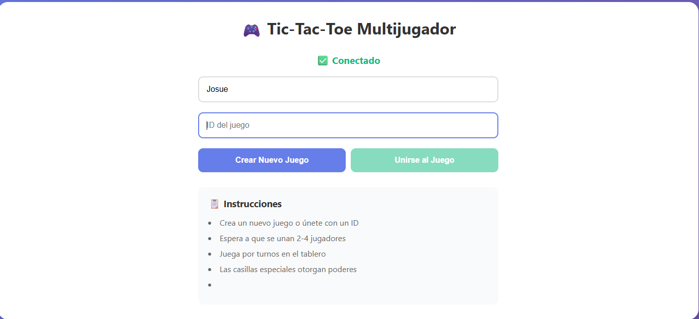
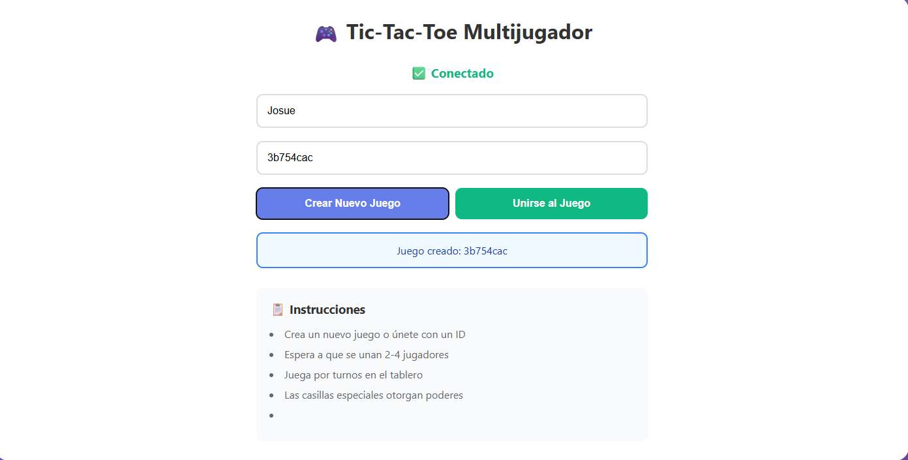
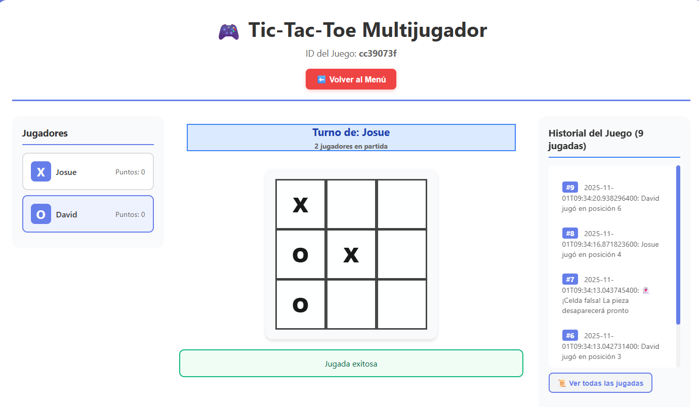

# 🎮 Tic-Tac-Toe Multijugador con WebSockets

Juego de Tic-Tac-Toe multijugador en tiempo real con poderes especiales, casillas trampa y efectos especiales. Desarrollado con **React** (frontend) y **Spring Boot** (backend) usando **WebSockets** para comunicación en tiempo real.

---

## 📋 Características Principales

### ✨ Funcionalidades Implementadas

1. **Multijugador en Tiempo Real (2)**
   - Conexión vía WebSockets con STOMP
   - Sincronización automática entre todos los jugadores
   - Sistema de turnos automático

2. **Sistema de Puntuación**
   - Seguimiento de puntos por jugador
   - Historial de jugadas previas
3. **Log de Eventos**
   - Registro de todas las acciones del juego
   - Notificaciones en tiempo real
   - Historial visible para todos los jugadores

---

## 🏗️ Arquitectura del Sistema

```
┌─────────────────────────────────────────────────────────┐
│                    FRONTEND (React)                     │
│  - Interfaz de usuario                                  │
│  - Cliente WebSocket (STOMP)                            │
│  - Gestión de estado del juego                          │
└────────────────────┬────────────────────────────────────┘
                     │
                     │ WebSocket/STOMP
                     │ (Tiempo Real)
                     │
┌────────────────────▼────────────────────────────────────┐
│              BACKEND (Spring Boot)                      │
│  - Servidor WebSocket                                   │
│  - Lógica de negocio del juego                         │
│  - Gestión de sesiones                                  │
│  - Sistema de poderes y efectos                         │
└─────────────────────────────────────────────────────────┘
```

---

## 🔌 Arquitectura WebSocket y Comunicación en Tiempo Real

### 📡 Descripción General

El juego utiliza **WebSocket** con el protocolo **STOMP (Simple Text Oriented Messaging Protocol)** para la comunicación bidireccional en tiempo real entre el frontend y el backend.

### 📂 Estructura de Carpetas Involucradas

```
ARSW-Parcial-2/
│
├── src/                                    # FRONTEND
│   ├── App.js                             # Cliente WebSocket + Lógica del juego
│   ├── index.js                           # Punto de entrada React
│   └── styles.css                         # Estilos de la aplicación
│
├── backend/src/main/java/com/arsw/tictactoe/
│   ├── config/
│   │   └── WebSocketConfig.java          # Configuración WebSocket/STOMP
│   │
│   ├── controller/
│   │   └── GameController.java           # Endpoints WebSocket y REST
│   │
│   ├── service/
│   │   └── GameService.java              # Lógica de negocio
│   │
│   ├── model/
│   │   ├── Game.java                     # Modelo del juego
│   │   ├── Player.java                   # Modelo del jugador
│   │   ├── Cell.java                     # Modelo de celda          
│   │   └── GameStatus.java               # Estados del juego
│   │
│   └── dto/
│       ├── GameMessage.java              # Mensajes WebSocket
│       ├── MoveRequest.java              # DTO para movimientos
│       ├── JoinGameRequest.java          # DTO para unirse
│       └── PowerRequest.java             # DTO para poderes
│
└── package.json                           # Dependencias frontend

## 🚀 Instalación y Ejecución

### Prerrequisitos

- **Java 17** o superior
- **Maven 3.6** o superior
- **Node.js 14** o superior
- **npm** o **yarn**

### 1. Backend (Spring Boot)

```bash
# Navegar a la carpeta del backend
cd backend

# Compilar el proyecto
mvn clean install

# Ejecutar el servidor
mvn spring-boot:run
```

El backend estará corriendo en: `http://localhost:8080`

### 2. Frontend (React)

```bash
# En la raíz del proyecto, instalar dependencias
npm install

# Ejecutar el cliente de desarrollo
npm start
```

El frontend estará corriendo en: `http://localhost:3000`

---
**Explicación**:
- **STOMP** (Simple Text Oriented Messaging Protocol): Protocolo sobre WebSocket
- **/topic**: Canal para mensajes broadcast (uno a muchos)
- **/app**: Prefijo para mensajes dirigidos a controladores
- **SockJS**: Fallback para navegadores sin soporte WebSocket nativo

---

**Flujo de una jugada**:

1. **Validar** que el juego esté activo
2. **Verificar** que sea el turno del jugador
3. **Comprobar** que la celda esté disponible
4. **Colocar** la pieza del jugador
5. **Aplicar** efecto de celda especial (si existe)
6. **Verificar** si hay ganador
7. **Avanzar** al siguiente turno

---
**Endpoints WebSocket**:

- **`/app/game/create`**: Crea un nuevo juego
- **`/app/game/join`**: Un jugador se une al juego
- **`/app/game/move`**: Hacer una jugada

**Canales de suscripción**:

- **`/topic/games`**: Lista global de juegos
- **`/topic/game/{gameId}`**: Eventos de un juego específico

---

## 🎮 Guía de Uso

### Crear y Unirse a un Juego

1. **Crear nuevo juego**:
   - Ingresa tu nombre de usuario
   - Click en "Crear Nuevo Juego"
   - Se genera un ID único (ej: `a3f7d2e1`)
   - Comparte el ID con otros jugadores

2. **Unirse a juego existente**:
   - Ingresa tu nombre de usuario
   - Ingresa el ID del juego
   - Click en "Unirse al Juego"
   - Espera a que el juego comience (mínimo 2 jugadores)

### Durante el Juego

1. **Tu turno**:
   - Las casillas disponibles se iluminan
   - Click en una casilla para jugar
   - Observa el efecto si es casilla especial


2. **Observar el estado**:
   - Panel de jugadores muestra turnos
   - Log del juego registra eventos
   

---

## 🔍 Flujo de Comunicación WebSocket

```
Cliente 1                 Servidor                Cliente 2
    |                        |                        |
    |------ Conectar ------->|                        |
    |                        |<------ Conectar -------|
    |                        |                        |
    |--- /app/game/create -->|                        |
    |                        |                        |
    |<-- /topic/games -------|                        |
    |   (Juego creado)       |                        |
    |                        |                        |
    |                        |<-- /app/game/join -----|
    |                        |                        |
    |<-- /topic/game/XXX ----|                        |
    |   (Jugador se unió)    |---- /topic/game/XXX -->|
    |                        |                        |
    |--- /app/game/move ---->|                        |
    |                        |                        |
    |<-- /topic/game/XXX ----|                        |
    |   (Jugada hecha)       |---- /topic/game/XXX -->|
    |                        |                        |
```

---

### Tipos de mensajes

- **GAME_UPDATE**: Actualización general del juego
- **PLAYER_JOINED**: Nuevo jugador se unió
- **PLAYER_LEFT**: Jugador abandonó
- **MOVE_MADE**: Jugada realizada
- **GAME_OVER**: Juego terminado
- **ERROR**: Error en operación

---
### Juego ejecución




