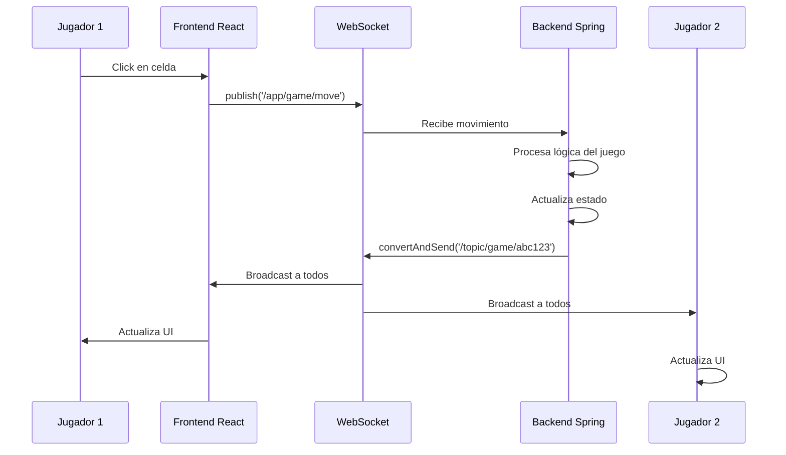

# 🎮 Tic-Tac-Toe Multijugador con WebSockets

Juego de Tic-Tac-Toe multijugador en tiempo real con poderes especiales, casillas trampa y efectos especiales. Desarrollado con **React** (frontend) y **Spring Boot** (backend) usando **WebSockets** para comunicación en tiempo real.

---

## 📋 Características Principales

### ✨ Funcionalidades Implementadas

1. **Multijugador en Tiempo Real (2-4 jugadores)**
   - Conexión vía WebSockets con STOMP
   - Sincronización automática entre todos los jugadores
   - Sistema de turnos automático

2. **Poderes Especiales** ⚡
   - **Extra Turn**: Juega dos veces seguidas
   - **Remove Opponent**: Elimina una pieza del oponente
   - **Swap Pieces**: Intercambia dos piezas en el tablero
   - **Reveal Trap**: Revela todas las casillas trampa
   - **Block Cell**: Bloquea una casilla por 2 turnos
   - **Triple Play**: Coloca 3 piezas de una vez

3. **Casillas Especiales** 🎯
   - **Trampa (💣)**: Pierdes un turno
   - **Poder (⚡)**: Ganas un poder aleatorio
   - **Falsa (👻)**: La pieza desaparece después de 2 turnos
   - **Puntos Dobles (💎)**: Vale doble si ganas con esta casilla
   - **Reversa (🔄)**: Invierte el orden de turnos

4. **Sistema de Puntuación**
   - Seguimiento de puntos por jugador
   - Puntos dobles en casillas especiales
   - Historial de partidas

5. **Log de Eventos**
   - Registro de todas las acciones del juego
   - Notificaciones en tiempo real
   - Historial visible para todos los jugadores

---

## 🏗️ Arquitectura del Sistema

```
┌─────────────────────────────────────────────────────────┐
│                    FRONTEND (React)                     │
│  - Interfaz de usuario                                  │
│  - Cliente WebSocket (STOMP)                            │
│  - Gestión de estado del juego                          │
└────────────────────┬────────────────────────────────────┘
                     │
                     │ WebSocket/STOMP
                     │ (Tiempo Real)
                     │
┌────────────────────▼────────────────────────────────────┐
│              BACKEND (Spring Boot)                      │
│  - Servidor WebSocket                                   │
│  - Lógica de negocio del juego                         │
│  - Gestión de sesiones                                  │
│  - Sistema de poderes y efectos                         │
└─────────────────────────────────────────────────────────┘
```

---

## 🔌 Arquitectura WebSocket y Comunicación en Tiempo Real

### 📡 Descripción General

El juego utiliza **WebSocket** con el protocolo **STOMP (Simple Text Oriented Messaging Protocol)** para la comunicación bidireccional en tiempo real entre el frontend y el backend.

### 📂 Estructura de Carpetas Involucradas

```
ARSW-Tic-Tac-Toe/
│
├── src/                                    # FRONTEND
│   ├── App.js                             # Cliente WebSocket + Lógica del juego
│   ├── index.js                           # Punto de entrada React
│   └── styles.css                         # Estilos de la aplicación
│
├── backend/src/main/java/com/arsw/tictactoe/
│   ├── config/
│   │   └── WebSocketConfig.java          # Configuración WebSocket/STOMP
│   │
│   ├── controller/
│   │   └── GameController.java           # Endpoints WebSocket y REST
│   │
│   ├── service/
│   │   └── GameService.java              # Lógica de negocio
│   │
│   ├── model/
│   │   ├── Game.java                     # Modelo del juego
│   │   ├── Player.java                   # Modelo del jugador
│   │   ├── Cell.java                     # Modelo de celda
│   │   ├── CellType.java                 # Tipos de celdas especiales
│   │   ├── PowerType.java                # Tipos de poderes
│   │   └── GameStatus.java               # Estados del juego
│   │
│   └── dto/
│       ├── GameMessage.java              # Mensajes WebSocket
│       ├── MoveRequest.java              # DTO para movimientos
│       ├── JoinGameRequest.java          # DTO para unirse
│       └── PowerRequest.java             # DTO para poderes
│
└── package.json                           # Dependencias frontend
```

### 🔧 Configuración WebSocket

#### Backend: `WebSocketConfig.java`

```java
@Configuration
@EnableWebSocketMessageBroker
public class WebSocketConfig implements WebSocketMessageBrokerConfigurer {
    
    @Override
    public void configureMessageBroker(MessageBrokerRegistry config) {
        // Configurar broker para mensajes del servidor → cliente
        config.enableSimpleBroker("/topic");
        
        // Prefijo para mensajes del cliente → servidor
        config.setApplicationDestinationPrefixes("/app");
    }
    
    @Override
    public void registerStompEndpoints(StompEndpointRegistry registry) {
        // Endpoint WebSocket con soporte para SockJS (fallback)
        registry.addEndpoint("/ws")
                .setAllowedOrigins("http://localhost:3000")
                .withSockJS();
    }
}
```

**Ubicación:** `backend/src/main/java/com/arsw/tictactoe/config/WebSocketConfig.java`

**Funcionalidad:**
- Define el endpoint WebSocket en `/ws`
- Configura STOMP con prefijo `/app` para mensajes entrantes
- Habilita broker `/topic` para broadcasting
- Permite conexiones desde `localhost:3000` (frontend)

#### Frontend: Conexión WebSocket en `App.js`

```javascript
import { Client } from '@stomp/stompjs';
import SockJS from 'sockjs-client';

// Conectar a WebSocket
useEffect(() => {
  const socket = new SockJS('http://localhost:8080/ws');
  const stompClient = new Client({
    webSocketFactory: () => socket,
    onConnect: () => {
      console.log('Conectado a WebSocket');
      setIsConnected(true);
    },
    onDisconnect: () => {
      console.log('Desconectado de WebSocket');
      setIsConnected(false);
    }
  });
  
  stompClient.activate();
  stompClientRef.current = stompClient;
  
  return () => {
    if (stompClient) {
      stompClient.deactivate();
    }
  };
}, []);
```

**Ubicación:** `src/App.js` (líneas 296-320)

**Funcionalidad:**
- Establece conexión WebSocket con el backend
- Maneja reconexión automática
- Gestiona estado de conexión

### 📨 Flujo de Comunicación WebSocket

#### 1. **Unirse a un Juego**

**Frontend → Backend:**
```javascript
stompClient.publish({
  destination: '/app/game/join',
  body: JSON.stringify({
    gameId: 'abc123',
    username: 'Josue'
  })
});
```

**Backend → Todos los jugadores:**
```javascript
messagingTemplate.convertAndSend('/topic/game/abc123', {
  type: 'PLAYER_JOINED',
  game: updatedGame,
  message: 'Josue se unió al juego'
});
```

**Código Backend:** `GameController.java` (líneas 47-73)

```java
@MessageMapping("/game/join")
public void joinGame(JoinGameRequest request) {
    Player player = gameService.joinGame(request.getGameId(), request.getUsername());
    Game game = gameService.getGame(request.getGameId()).orElse(null);
    
    if (game != null) {
        GameMessage message = new GameMessage(
            MessageType.PLAYER_JOINED,
            game,
            player.getUsername() + " se unió al juego",
            player.getId()
        );
        
        // Enviar a todos los suscriptores del juego
        messagingTemplate.convertAndSend("/topic/game/" + request.getGameId(), message);
    }
}
```

#### 2. **Hacer una Jugada**

**Frontend → Backend:**
```javascript
stompClient.publish({
  destination: '/app/game/move',
  body: JSON.stringify({
    gameId: 'abc123',
    playerId: 'player1',
    position: 4
  })
});
```

**Backend → Todos los jugadores:**
```javascript
messagingTemplate.convertAndSend('/topic/game/abc123', {
  type: 'MOVE_MADE',
  game: updatedGame,
  message: 'Josue jugó en posición 4'
});
```

**Código Backend:** `GameController.java` (líneas 78-117)

```java
@MessageMapping("/game/move")
public void makeMove(MoveRequest request) {
    MoveResult result = gameService.makeMove(
        request.getGameId(),
        request.getPlayerId(),
        request.getPosition()
    );
    
    Game game = gameService.getGame(request.getGameId()).orElse(null);
    
    if (result.isSuccess() && game != null) {
        GameMessage message = new GameMessage(
            MessageType.MOVE_MADE,
            game,
            result.getMessage(),
            request.getPlayerId()
        );
        
        messagingTemplate.convertAndSend("/topic/game/" + request.getGameId(), message);
    }
}
```

#### 3. **Usar un Poder**

**Frontend → Backend:**
```javascript
stompClient.publish({
  destination: '/app/game/power',
  body: JSON.stringify({
    gameId: 'abc123',
    playerId: 'player1',
    powerType: 'REMOVE_OPPONENT',
    targetPosition: 2
  })
});
```

**Backend → Todos los jugadores:**
```javascript
messagingTemplate.convertAndSend('/topic/game/abc123', {
  type: 'GAME_UPDATE',
  game: updatedGame,
  message: 'Poder usado: REMOVE_OPPONENT'
});
```

**Código Backend:** `GameController.java` (líneas 122-143)

### 🎯 Suscripción a Canales

Cada juego tiene su propio canal de comunicación:

```javascript
// Frontend se suscribe al canal específico del juego
stompClient.subscribe(`/topic/game/${gameId}`, (message) => {
  const gameMessage = JSON.parse(message.body);
  
  // Actualizar estado del juego
  if (gameMessage.game) {
    setGame(gameMessage.game);
  }
  
  // Mostrar mensaje
  if (gameMessage.message) {
    setMessage(gameMessage.message);
  }
});
```

**Ubicación:** `src/App.js` (líneas 371-393)

### 🔄 Flujo Completo de una Jugada



### 📦 Modelos de Datos WebSocket

#### `GameMessage.java`

```java
@Data
@AllArgsConstructor
@NoArgsConstructor
public class GameMessage {
    private MessageType type;      // PLAYER_JOINED, MOVE_MADE, GAME_UPDATE, etc.
    private Game game;              // Estado completo del juego
    private String message;         // Mensaje descriptivo
    private String playerId;        // ID del jugador que hizo la acción
    
    public enum MessageType {
        GAME_UPDATE,
        PLAYER_JOINED,
        MOVE_MADE,
        GAME_OVER,
        ERROR
    }
}
```

**Ubicación:** `backend/src/main/java/com/arsw/tictactoe/dto/GameMessage.java`

### 🔐 Persistencia y Reconexión

El sistema incluye persistencia en `localStorage` para mantener la sesión:

```javascript
// Guardar datos al unirse
localStorage.setItem('tictactoe_gameId', gameId);
localStorage.setItem('tictactoe_username', username);
localStorage.setItem('tictactoe_currentPlayer', JSON.stringify(player));

// Reconectar automáticamente al recargar
useEffect(() => {
  const savedGameId = localStorage.getItem('tictactoe_gameId');
  const savedUsername = localStorage.getItem('tictactoe_username');
  
  if (isConnected && savedGameId && savedUsername) {
    joinGame();
  }
}, [isConnected]);
```

**Ubicación:** `src/App.js` (líneas 254-283)

---

## 🔗 Conexión Backend-Frontend

### 📡 Descripción General de la Comunicación

El frontend (React) y el backend (Spring Boot) se comunican a través de **dos canales**:

1. **WebSocket/STOMP**: Para comunicación en tiempo real (jugadas, actualizaciones de estado)
2. **HTTP REST**: Para operaciones iniciales (crear juego, reiniciar)

### 🌐 Configuración de Red

#### Backend: `application.properties`

```properties
# Puerto del servidor
server.port=8080

# Configuración WebSocket
spring.websocket.allowed-origins=http://localhost:3000
```

**Ubicación:** `backend/src/main/resources/application.properties`

#### Frontend: `package.json`

```json
{
  "proxy": "http://localhost:8080",
  "dependencies": {
    "@stomp/stompjs": "^7.0.0",
    "sockjs-client": "^1.6.1"
  }
}
```

**Ubicación:** `package.json`

**Funcionalidad del Proxy:**
- Redirige peticiones REST desde `localhost:3000` hacia `localhost:8080`
- Evita problemas de CORS en desarrollo
- Permite usar rutas relativas en el frontend (`/api/games`)

### 🔌 Endpoints de Comunicación

#### 1. **Endpoints REST (HTTP)**

Usados para operaciones no frecuentes:

| Método | Endpoint | Descripción | Ubicación Backend |
|--------|----------|-------------|-------------------|
| `POST` | `/api/games` | Crear nuevo juego | `GameController.java:166-170` |
| `GET` | `/api/games` | Listar todos los juegos | `GameController.java:148-152` |
| `GET` | `/api/games/{id}` | Obtener juego específico | `GameController.java:157-161` |
| `POST` | `/api/games/{id}/restart` | Reiniciar juego | `GameController.java:175-192` |

**Ejemplo de uso en Frontend:**

```javascript
// Crear nuevo juego
const createGame = async () => {
  const response = await fetch('/api/games', {
    method: 'POST',
    headers: { 'Content-Type': 'application/json' }
  });
  const newGame = await response.json();
  setGameId(newGame.gameId);
};

// Reiniciar juego
const handleRestart = async () => {
  const response = await fetch(`/api/games/${game.gameId}/restart`, {
    method: 'POST',
    headers: { 'Content-Type': 'application/json' }
  });
};
```

**Ubicación Frontend:** `src/App.js` (líneas 332-346, 481-495)

#### 2. **Endpoints WebSocket (STOMP)**

Usados para comunicación en tiempo real:

| Destino | Tipo | Descripción | Ubicación Backend |
|---------|------|-------------|-------------------|
| `/app/game/join` | Cliente → Servidor | Unirse a un juego | `GameController.java:47-73` |
| `/app/game/move` | Cliente → Servidor | Hacer una jugada | `GameController.java:78-117` |
| `/app/game/power` | Cliente → Servidor | Usar un poder | `GameController.java:122-143` |
| `/topic/game/{id}` | Servidor → Clientes | Broadcasting de actualizaciones | Múltiples líneas |

**Ejemplo de uso en Frontend:**

```javascript
// Suscribirse a actualizaciones del juego
stompClient.subscribe(`/topic/game/${gameId}`, (message) => {
  const gameMessage = JSON.parse(message.body);
  setGame(gameMessage.game);
});

// Enviar jugada
stompClient.publish({
  destination: '/app/game/move',
  body: JSON.stringify({
    gameId: 'abc123',
    playerId: 'player1',
    position: 4
  })
});
```

**Ubicación Frontend:** `src/App.js` (líneas 371-437)

### 🛠️ Configuración CORS

#### Backend: `WebSocketConfig.java`

```java
@Override
public void registerStompEndpoints(StompEndpointRegistry registry) {
    registry.addEndpoint("/ws")
            .setAllowedOrigins("http://localhost:3000")  // Permitir frontend
            .withSockJS();  // Fallback para navegadores sin WebSocket
}
```

**Ubicación:** `backend/src/main/java/com/arsw/tictactoe/config/WebSocketConfig.java:31-35`

**Funcionalidad:**
- Permite conexiones WebSocket desde `localhost:3000`
- SockJS proporciona fallback automático si WebSocket no está disponible
- Soporte para long-polling y streaming en navegadores antiguos

### 🔄 Flujo Completo de Conexión

```
┌─────────────────────────────────────────────────────────────┐
│ INICIO DE APLICACIÓN                                        │
└─────────────────────────────────────────────────────────────┘
                           │
                           ▼
┌─────────────────────────────────────────────────────────────┐
│ 1. FRONTEND: Inicializa conexión WebSocket                 │
│    • new SockJS('http://localhost:8080/ws')                │
│    • stompClient.activate()                                 │
└─────────────────────────────────────────────────────────────┘
                           │
                           ▼
┌─────────────────────────────────────────────────────────────┐
│ 2. BACKEND: Acepta conexión WebSocket                      │
│    • Endpoint: /ws                                          │
│    • Verifica origen permitido                              │
│    • Establece canal STOMP                                  │
└─────────────────────────────────────────────────────────────┘
                           │
                           ▼
┌─────────────────────────────────────────────────────────────┐
│ 3. FRONTEND: Crear/Unirse a juego                          │
│    • REST: POST /api/games (crear)                         │
│    • STOMP: /app/game/join (unirse)                        │
└─────────────────────────────────────────────────────────────┘
                           │
                           ▼
┌─────────────────────────────────────────────────────────────┐
│ 4. BACKEND: Procesa petición                               │
│    • GameService.createGame() / joinGame()                 │
│    • Actualiza estado del juego                             │
│    • Genera GameMessage                                     │
└─────────────────────────────────────────────────────────────┘
                           │
                           ▼
┌─────────────────────────────────────────────────────────────┐
│ 5. BACKEND: Broadcasting vía WebSocket                     │
│    • messagingTemplate.convertAndSend()                    │
│    • Envía a /topic/game/{gameId}                          │
│    • Todos los jugadores reciben actualización              │
└─────────────────────────────────────────────────────────────┘
                           │
                           ▼
┌─────────────────────────────────────────────────────────────┐
│ 6. FRONTEND: Recibe actualización                          │
│    • Callback de subscribe() ejecutado                      │
│    • setGame(gameMessage.game)                             │
│    • UI se actualiza automáticamente (React)                │
└─────────────────────────────────────────────────────────────┘
```

### 📦 Formato de Datos

#### Request: Unirse a un Juego

**Frontend → Backend**

```javascript
{
  "gameId": "5dfcd0c0",
  "username": "Josue"
}
```

**Código Backend:**
```java
@Data
public class JoinGameRequest {
    private String gameId;
    private String username;
}
```

**Ubicación:** `backend/src/main/java/com/arsw/tictactoe/dto/JoinGameRequest.java`

#### Response: Estado del Juego

**Backend → Frontend**

```javascript
{
  "type": "PLAYER_JOINED",
  "game": {
    "gameId": "5dfcd0c0",
    "players": [
      {
        "id": "player-123",
        "username": "Josue",
        "symbol": "X",
        "score": 0,
        "powers": [],
        "isActive": true
      }
    ],
    "board": [
      { "position": 0, "value": null, "type": "NORMAL", "isRevealed": false },
      { "position": 1, "value": null, "type": "POWER", "isRevealed": false },
      // ... 7 celdas más
    ],
    "status": "WAITING",
    "currentPlayerIndex": 0,
    "gameLog": ["Josue se unió al juego"]
  },
  "message": "Josue se unió al juego",
  "playerId": "player-123"
}
```

**Código Backend:**
```java
@Data
public class GameMessage {
    private MessageType type;
    private Game game;
    private String message;
    private String playerId;
}
```

**Ubicación:** `backend/src/main/java/com/arsw/tictactoe/dto/GameMessage.java`

### 🧪 Pruebas de Conexión

#### Verificar Backend

```bash
# Verificar que el servidor esté corriendo
curl http://localhost:8080/api/games
```

**Respuesta esperada:**
```json
[]  # Lista vacía si no hay juegos
```

#### Verificar WebSocket

```bash
# En el navegador, abrir consola de desarrollador (F12)
# Debería ver en la consola:
# "STOMP: Conectado"
# "Conectado a WebSocket"
```

#### Verificar Proxy

```javascript
// En la consola del navegador:
fetch('/api/games')
  .then(r => r.json())
  .then(console.log)

// Debería ver la lista de juegos
```

### ⚠️ Troubleshooting Común

#### Problema: "No se puede conectar al servidor"

**Solución:**
1. Verificar que el backend esté corriendo: `http://localhost:8080`
2. Verificar que el frontend esté en: `http://localhost:3000`
3. Revisar CORS en `WebSocketConfig.java`

#### Problema: "WebSocket connection failed"

**Solución:**
1. Verificar que SockJS esté habilitado
2. Comprobar firewall o antivirus
3. Usar navegador moderno (Chrome, Firefox, Edge)

#### Problema: "502 Bad Gateway"

**Solución:**
1. Backend no está corriendo
2. Puerto 8080 ocupado por otra aplicación
3. Reiniciar ambos servidores

### 📊 Monitoreo de Conexiones

#### Backend: Logs

```bash
# Ver logs del servidor
mvn spring-boot:run

# Buscar:
# "Conectado a WebSocket"
# "Celda especial creada en posición X"
# "Tablero inicializado con X celdas especiales"
```

#### Frontend: Consola del Navegador

```javascript
// Activar debug de STOMP
const stompClient = new Client({
  debug: (str) => {
    console.log('STOMP:', str);  // Ver todos los mensajes STOMP
  }
});
```

**Ubicación:** `src/App.js` (líneas 308-312)

### 🔐 Seguridad de la Conexión

**Configuraciones Actuales:**

- ✅ CORS configurado para permitir solo `localhost:3000`
- ✅ WebSocket endpoint específico (`/ws`)
- ✅ Validación de origen en SockJS
- ✅ Mensajes tipados con DTOs

**Para Producción (TODO):**

- 🔒 Implementar autenticación JWT
- 🔒 HTTPS/WSS (WebSocket Secure)
- 🔒 Rate limiting
- 🔒 Validación de input en backend
- 🔒 Configurar CORS para dominio específico

---

## 🚀 Instalación y Ejecución

### Prerrequisitos

- **Java 17** o superior
- **Maven 3.6** o superior
- **Node.js 14** o superior
- **npm** o **yarn**

### 1. Backend (Spring Boot)

```bash
# Navegar a la carpeta del backend
cd backend

# Compilar el proyecto
mvn clean install

# Ejecutar el servidor
mvn spring-boot:run
```

El backend estará corriendo en: `http://localhost:8080`

### 2. Frontend (React)

```bash
# En la raíz del proyecto, instalar dependencias
npm install

# Ejecutar el cliente de desarrollo
npm start
```

El frontend estará corriendo en: `http://localhost:3000`

---

## 🆕 Modificaciones y Mejoras Recientes

### 1. **Sistema de Poderes Interactivo** ⚡

**Archivos modificados:**
- `src/App.js` (líneas 440-478)
- `src/styles.css` (líneas 440-480)

**Funcionalidad:**
- Los poderes ahora tienen una **interfaz visual interactiva**
- Al seleccionar un poder, se muestra un **banner amarillo animado**
- Para poderes que requieren objetivo:
  1. Click en el poder → Se activa el modo de selección
  2. Click en una celda del tablero → Se aplica el poder
  3. O click en "❌ Cancelar" → Cancela la selección
- Botones de poderes cambian a **naranja** cuando están seleccionados
- Los demás poderes se deshabilitan temporalmente

**Código:**
```javascript
// Estado para manejar poder seleccionado
const [selectedPower, setSelectedPower] = useState(null);

const handleUsePower = (powerType) => {
  const needsTarget = ['REMOVE_OPPONENT', 'BLOCK_CELL', 'REVEAL_TRAP'].includes(powerType);
  
  if (needsTarget) {
    setSelectedPower(powerType);
    setMessage(`🎯 Selecciona una celda para usar: ${powerType}`);
  } else {
    // Usar poder directamente
    stompClient.publish({
      destination: '/app/game/power',
      body: JSON.stringify({ gameId, playerId, powerType, targetPosition: -1 })
    });
  }
};
```

### 2. **Celdas Especiales Ocultas** 🎲

**Archivos modificados:**
- `backend/src/main/java/com/arsw/tictactoe/model/Game.java` (líneas 46-69)
- `src/App.js` (líneas 7-49)

**Funcionalidad:**
- Las celdas especiales ahora están **ocultas** al inicio del juego
- Se revelan solo cuando un jugador selecciona esa casilla
- Crea efecto de **sorpresa** y estrategia
- Las celdas mantienen sus efectos pero sin indicadores visuales previos

**Código Backend:**
```java
private List<Cell> initializeBoard() {
    for (int i = 0; i < 9; i++) {
        Cell cell = new Cell(i);
        
        if (specialCellsEnabled && random.nextDouble() < 0.5) {
            CellType[] types = CellType.values();
            int randomIndex = random.nextInt(types.length - 1) + 1;
            cell.setType(types[randomIndex]);
            // NO revelar - se revelará al jugarse
        }
        
        cells.add(cell);
    }
    return cells;
}
```

**Código Frontend:**
```javascript
const getCellContent = () => {
  if (cell.value) {
    return <span>{cell.value}</span>;
  }
  
  // Mostrar icono SOLO si está revelada
  if (cell.isRevealed && cell.type !== 'NORMAL') {
    const icons = {
      TRAP: '💣', POWER: '⚡', FAKE: '👻',
      DOUBLE_POINTS: '💎', REVERSE: '🔄'
    };
    return icons[cell.type] || '?';
  }
  
  return '';
};
```

### 3. **Persistencia y Reconexión Automática** 💾

**Archivos modificados:**
- `src/App.js` (líneas 254-283, 368-376)

**Funcionalidad:**
- Guarda el estado del juego en `localStorage`
- Al recargar la página, **reconecta automáticamente** al juego
- Mantiene el ID del jugador, nombre de usuario y partida activa
- Evita perder progreso por refrescos accidentales

**Código:**
```javascript
// Guardar en localStorage al unirse
localStorage.setItem('tictactoe_gameId', gameId);
localStorage.setItem('tictactoe_username', username);
localStorage.setItem('tictactoe_currentPlayer', JSON.stringify(player));

// Cargar y reconectar al iniciar
useEffect(() => {
  const savedGameId = localStorage.getItem('tictactoe_gameId');
  const savedUsername = localStorage.getItem('tictactoe_username');
  
  if (savedGameId) setGameId(savedGameId);
  if (savedUsername) setUsername(savedUsername);
}, []);

// Reconexión automática
useEffect(() => {
  if (isConnected && gameId && username && !game) {
    setTimeout(() => joinGame(), 1000);
  }
}, [isConnected]);
```

### 4. **Botón "Volver al Menú"** ⬅️

**Archivos modificados:**
- `src/App.js` (líneas 479-496, 632-638)
- `src/styles.css` (líneas 47-69)

**Funcionalidad:**
- Botón rojo en el header del juego
- Permite salir del lobby sin cerrar la aplicación
- Limpia el estado y el `localStorage`
- Regresa a la pantalla de inicio para crear/unirse a otro juego

**Código:**
```javascript
const handleLeaveLobby = () => {
  setGame(null);
  setCurrentPlayer(null);
  setGameId('');
  setGameSnapshots([]);
  hasAttemptedReconnect.current = false;
  
  // Limpiar localStorage
  localStorage.removeItem('tictactoe_gameId');
  localStorage.removeItem('tictactoe_username');
  localStorage.removeItem('tictactoe_currentPlayer');
};
```

### 5. **Historial Interactivo con Snapshots** 📸

**Archivos modificados:**
- `src/App.js` (líneas 195-238, 285-288)
- `src/styles.css` (líneas 571-656)

**Funcionalidad:**
- Cada jugada guarda un **snapshot del tablero**
- Hacer click en una jugada del historial muestra el tablero en ese momento
- Banner amarillo indica que estás viendo una jugada pasada
- Botón "⏩ Volver al presente" regresa al estado actual
- Permite analizar el desarrollo del juego

**Código:**
```javascript
// Guardar snapshots
useEffect(() => {
  if (game && game.board) {
    const snapshot = {
      board: JSON.parse(JSON.stringify(game.board)),
      players: JSON.parse(JSON.stringify(game.players)),
      currentPlayerIndex: game.currentPlayerIndex,
      status: game.status,
      moveNumber: gameSnapshots.length
    };
    setGameSnapshots(prev => [...prev, snapshot]);
  }
}, [game?.gameLog?.length]);

// Componente GameLog con navegación
<div className="log-entry" onClick={() => onSelectSnapshot(idx)}>
  <span className="move-number">#{idx + 1}</span> {entry}
</div>
```

### 6. **Mejoras de UX y Validación** ✨

**Archivos modificados:**
- `src/App.js` (líneas 349-409, 559-577)

**Funcionalidad:**
- Validación de conexión WebSocket antes de permitir acciones
- Mensajes de error claros y descriptivos
- Banner de advertencia cuando el backend no está conectado
- Indicadores visuales del estado de conexión (✅/❌)
- Manejo robusto de errores con try-catch

**Código:**
```javascript
// Validación en joinGame
if (!stompClientRef.current.connected) {
  setMessage('Conectando al servidor... Intenta de nuevo');
  return;
}

// Banner de advertencia
{!isConnected && (
  <div style={{ background: '#fee2e2', color: '#991b1b', ... }}>
    <strong>⚠️ No se puede conectar al servidor</strong>
    <p>Asegúrate de que el backend esté corriendo en el puerto 8080.</p>
  </div>
)}
```

### 7. **Sistema de Reinicio sin Salir del Lobby** 🔄

**Archivos modificados:**
- `backend/src/main/java/com/arsw/tictactoe/controller/GameController.java` (líneas 175-192)
- `backend/src/main/java/com/arsw/tictactoe/service/GameService.java` (líneas 170-194)
- `src/App.js` (líneas 481-495)

**Funcionalidad:**
- Botón "🔄 Volver a Jugar" aparece al terminar el juego
- Reinicia el tablero **manteniendo a los jugadores** en el lobby
- Los jugadores conservan sus puntuaciones acumuladas
- Notifica vía WebSocket a todos los participantes

**Código Backend:**
```java
@PostMapping("/api/games/{gameId}/restart")
public Game restartGame(@PathVariable String gameId) {
    Game game = gameService.restartGame(gameId);
    
    if (game != null) {
        GameMessage message = new GameMessage(
            MessageType.GAME_UPDATE,
            game,
            "El juego ha sido reiniciado",
            null
        );
        messagingTemplate.convertAndSend("/topic/game/" + gameId, message);
    }
    
    return game;
}
```

### 8. **Estilos Visuales Mejorados** 🎨

**Archivos modificados:**
- `src/styles.css` (múltiples líneas)

**Mejoras:**
- Bordes de celdas más oscuros y visibles (`#333`)
- Texto X y O con grosor máximo (`font-weight: 900`)
- Opacidad reducida en celdas deshabilitadas (0.9 vs 0.6)
- Animaciones suaves en transiciones
- Scrollbar personalizado para historial
- Colores de celdas especiales más distinguibles

---

## 📚 Documentación Técnica

### Backend - Estructura del Proyecto

```
backend/
├── src/main/java/com/arsw/tictactoe/
│   ├── TicTacToeApplication.java          # Clase principal
│   ├── config/
│   │   └── WebSocketConfig.java           # Configuración WebSocket
│   ├── controller/
│   │   └── GameController.java            # Controlador WebSocket
│   ├── service/
│   │   └── GameService.java               # Lógica de negocio
│   ├── model/
│   │   ├── Game.java                      # Modelo del juego
│   │   ├── Player.java                    # Modelo del jugador
│   │   ├── Cell.java                      # Modelo de celda
│   │   ├── CellType.java                  # Tipos de celdas
│   │   ├── PowerType.java                 # Tipos de poderes
│   │   ├── GameStatus.java                # Estados del juego
│   │   ├── MoveResult.java                # Resultado de jugada
│   │   └── CellEffect.java                # Efectos de celdas
│   └── dto/
│       ├── GameMessage.java               # Mensaje WebSocket
│       ├── MoveRequest.java               # Request de jugada
│       ├── JoinGameRequest.java           # Request unirse
│       └── PowerRequest.java              # Request usar poder
```

---

## 🔧 Funcionalidades Detalladas

### 1. Configuración de WebSocket

**Archivo**: `WebSocketConfig.java`

```java
@Configuration
@EnableWebSocketMessageBroker
public class WebSocketConfig implements WebSocketMessageBrokerConfigurer {
    
    @Override
    public void configureMessageBroker(MessageBrokerRegistry config) {
        config.enableSimpleBroker("/topic");      // Broker para broadcasting
        config.setApplicationDestinationPrefixes("/app");  // Prefijo para mensajes
    }
    
    @Override
    public void registerStompEndpoints(StompEndpointRegistry registry) {
        registry.addEndpoint("/ws")               // Endpoint WebSocket
                .setAllowedOriginPatterns("*")
                .withSockJS();                     // Fallback SockJS
    }
}
```

**Explicación**:
- **STOMP** (Simple Text Oriented Messaging Protocol): Protocolo sobre WebSocket
- **/topic**: Canal para mensajes broadcast (uno a muchos)
- **/app**: Prefijo para mensajes dirigidos a controladores
- **SockJS**: Fallback para navegadores sin soporte WebSocket nativo

---

### 2. Modelo de Jugador

**Archivo**: `Player.java`

```java
@Data
public class Player {
    private String id;              // ID único
    private String username;        // Nombre
    private String symbol;          // Símbolo (X, O, △, □)
    private int score;              // Puntuación
    private List<PowerType> powers; // Poderes disponibles
    private boolean isActive;       // Turno actual
    
    public void addPower(PowerType power) {
        if (this.powers == null) {
            this.powers = new ArrayList<>();
        }
        this.powers.add(power);
    }
    
    public boolean usePower(PowerType power) {
        if (this.powers != null && this.powers.contains(power)) {
            this.powers.remove(power);
            return true;
        }
        return false;
    }
}
```

**Explicación**:
- Cada jugador tiene un ID único generado por UUID
- El símbolo se asigna automáticamente al unirse (X, O, △, □)
- Los poderes se acumulan al caer en casillas especiales
- Solo puede ser activo el jugador en turno

---

### 3. Tipos de Poderes

**Archivo**: `PowerType.java`

```java
public enum PowerType {
    EXTRA_TURN("Extra Turn", "Juega dos veces seguidas"),
    REMOVE_OPPONENT("Remove Opponent", "Elimina una pieza del oponente"),
    SWAP_PIECES("Swap Pieces", "Intercambia dos piezas"),
    REVEAL_TRAP("Reveal Trap", "Revela todas las trampas"),
    BLOCK_CELL("Block Cell", "Bloquea una casilla temporalmente"),
    TRIPLE_PLAY("Triple Play", "Coloca 3 piezas de una vez");
    
    private final String displayName;
    private final String description;
    
    PowerType(String displayName, String description) {
        this.displayName = displayName;
        this.description = description;
    }
}
```

**Explicación de cada poder**:

1. **EXTRA_TURN**: 
   - El jugador puede jugar inmediatamente después de su turno actual
   - Útil para hacer jugadas consecutivas estratégicas

2. **REMOVE_OPPONENT**: 
   - Elimina una pieza del oponente del tablero
   - El jugador selecciona la posición objetivo
   - No puede eliminar piezas que formen parte de una línea ganadora

3. **SWAP_PIECES**: 
   - Intercambia la posición de dos piezas en el tablero
   - Puede usarse para romper líneas del oponente

4. **REVEAL_TRAP**: 
   - Muestra todas las casillas trampa ocultas
   - Ventaja estratégica para evitar trampas

5. **BLOCK_CELL**: 
   - Bloquea una casilla vacía por 2 turnos
   - Impide que cualquier jugador use esa posición

6. **TRIPLE_PLAY**: 
   - Permite colocar 3 piezas en un solo turno
   - Puede cambiar el juego dramáticamente

---

### 4. Modelo de Celda

**Archivo**: `Cell.java`

```java
@Data
public class Cell {
    private int position;        // 0-8 para tablero 3x3
    private String value;        // null, "X", "O", etc.
    private CellType type;       // NORMAL, TRAP, POWER, etc.
    private boolean isRevealed;  // Si el tipo está visible
    private boolean isBlocked;   // Si está bloqueada
    private int blockedTurns;    // Turnos restantes de bloqueo
    
    public boolean isOccupied() {
        return value != null && !value.isEmpty();
    }
    
    public boolean isPlayable() {
        return !isOccupied() && !isBlocked;
    }
}
```

**Tipos de Celdas** (`CellType.java`):

```java
public enum CellType {
    NORMAL,         // Celda estándar
    TRAP,           // Pierde turno
    POWER,          // Gana poder
    FAKE,           // Pieza desaparece
    DOUBLE_POINTS,  // Puntos x2
    REVERSE         // Invierte turnos
}
```

**Explicación de efectos**:

- **TRAP (💣)**: Al jugar aquí, el jugador pierde su siguiente turno
- **POWER (⚡)**: Otorga un poder aleatorio al jugador
- **FAKE (👻)**: La pieza colocada desaparecerá después de 2 turnos
- **DOUBLE_POINTS (💎)**: Si ganas con esta celda en tu línea, puntos x2
- **REVERSE (🔄)**: Invierte temporalmente el orden de los turnos

---

### 5. Lógica del Juego

**Archivo**: `Game.java` - Método principal de jugada

```java
public MoveResult makeMove(String playerId, int position) {
    MoveResult result = new MoveResult();
    
    // 1. Validaciones
    if (status != GameStatus.ACTIVE) {
        result.setSuccess(false);
        result.setMessage("El juego no está activo");
        return result;
    }
    
    Player currentPlayer = getCurrentPlayer();
    if (!currentPlayer.getId().equals(playerId)) {
        result.setSuccess(false);
        result.setMessage("No es tu turno");
        return result;
    }
    
    Cell cell = board.get(position);
    if (!cell.isPlayable()) {
        result.setSuccess(false);
        result.setMessage("Celda no disponible");
        return result;
    }
    
    // 2. Ejecutar jugada
    cell.setValue(currentPlayer.getSymbol());
    cell.setRevealed(true);
    
    // 3. Aplicar efecto de celda especial
    CellEffect effect = applyCellEffect(cell, currentPlayer);
    result.setCellEffect(effect);
    
    // 4. Verificar ganador
    String winner = checkWinner();
    if (winner != null) {
        this.winner = winner;
        this.status = GameStatus.FINISHED;
        // Actualizar puntuación...
    }
    
    // 5. Siguiente turno
    if (effect != CellEffect.SKIP_TURN) {
        nextPlayer();
    } else {
        nextPlayer(); // Salta
        nextPlayer(); // Y avanza
    }
    
    result.setSuccess(true);
    return result;
}
```

**Flujo de una jugada**:

1. **Validar** que el juego esté activo
2. **Verificar** que sea el turno del jugador
3. **Comprobar** que la celda esté disponible
4. **Colocar** la pieza del jugador
5. **Aplicar** efecto de celda especial (si existe)
6. **Verificar** si hay ganador
7. **Avanzar** al siguiente turno

---

### 6. Controlador WebSocket

**Archivo**: `GameController.java`

```java
@Controller
public class GameController {
    
    @Autowired
    private GameService gameService;
    
    @Autowired
    private SimpMessagingTemplate messagingTemplate;
    
    // Crear juego
    @MessageMapping("/game/create")
    @SendTo("/topic/games")
    public GameMessage createGame() {
        Game game = gameService.createGame();
        return new GameMessage(
            GameMessage.MessageType.GAME_UPDATE,
            game,
            "Nuevo juego creado: " + game.getGameId(),
            null
        );
    }
    
    // Unirse a juego
    @MessageMapping("/game/join")
    public void joinGame(JoinGameRequest request) {
        Player player = gameService.joinGame(request.getGameId(), request.getUsername());
        Game game = gameService.getGame(request.getGameId()).orElse(null);
        
        GameMessage message = new GameMessage(
            GameMessage.MessageType.PLAYER_JOINED,
            game,
            player.getUsername() + " se unió al juego",
            player.getId()
        );
        
        // Broadcast a todos los suscriptores del juego
        messagingTemplate.convertAndSend(
            "/topic/game/" + request.getGameId(), 
            message
        );
    }
    
    // Hacer jugada
    @MessageMapping("/game/move")
    public void makeMove(MoveRequest request) {
        MoveResult result = gameService.makeMove(
            request.getGameId(),
            request.getPlayerId(),
            request.getPosition()
        );
        
        Game game = gameService.getGame(request.getGameId()).orElse(null);
        
        if (result.isSuccess()) {
            GameMessage message = new GameMessage(
                GameMessage.MessageType.MOVE_MADE,
                game,
                result.getMessage(),
                request.getPlayerId()
            );
            
            messagingTemplate.convertAndSend(
                "/topic/game/" + request.getGameId(), 
                message
            );
        }
    }
    
    // Usar poder
    @MessageMapping("/game/power")
    public void usePower(PowerRequest request) {
        boolean success = gameService.usePower(
            request.getGameId(),
            request.getPlayerId(),
            request.getPowerType(),
            request.getTargetPosition()
        );
        
        if (success) {
            Game game = gameService.getGame(request.getGameId()).orElse(null);
            GameMessage message = new GameMessage(
                GameMessage.MessageType.GAME_UPDATE,
                game,
                "Poder usado: " + request.getPowerType(),
                request.getPlayerId()
            );
            
            messagingTemplate.convertAndSend(
                "/topic/game/" + request.getGameId(), 
                message
            );
        }
    }
}
```

**Endpoints WebSocket**:

- **`/app/game/create`**: Crea un nuevo juego
- **`/app/game/join`**: Un jugador se une al juego
- **`/app/game/move`**: Hacer una jugada
- **`/app/game/power`**: Usar un poder especial

**Canales de suscripción**:

- **`/topic/games`**: Lista global de juegos
- **`/topic/game/{gameId}`**: Eventos de un juego específico

---

### 7. Frontend - Conexión WebSocket

**Archivo**: `App.js` - Configuración del cliente

```javascript
useEffect(() => {
  const socket = new SockJS('http://localhost:8080/ws');
  const stompClient = new Client({
    webSocketFactory: () => socket,
    onConnect: () => {
      console.log('Conectado a WebSocket');
      setIsConnected(true);
    },
    onDisconnect: () => {
      console.log('Desconectado');
      setIsConnected(false);
    }
  });
  
  stompClient.activate();
  stompClientRef.current = stompClient;
  
  return () => {
    if (stompClient) {
      stompClient.deactivate();
    }
  };
}, []);
```

**Suscribirse a eventos del juego**:

```javascript
stompClientRef.current.subscribe(`/topic/game/${gameId}`, (message) => {
  const gameMessage = JSON.parse(message.body);
  
  if (gameMessage.game) {
    setGame(gameMessage.game);  // Actualizar estado
  }
  
  if (gameMessage.type === 'PLAYER_JOINED') {
    // Manejar nuevo jugador
  }
  
  if (gameMessage.type === 'MOVE_MADE') {
    // Manejar jugada
  }
  
  if (gameMessage.type === 'GAME_OVER') {
    // Manejar fin de juego
  }
});
```

**Enviar mensajes al servidor**:

```javascript
// Unirse a juego
stompClientRef.current.publish({
  destination: '/app/game/join',
  body: JSON.stringify({
    gameId: gameId,
    username: username
  })
});

// Hacer jugada
stompClientRef.current.publish({
  destination: '/app/game/move',
  body: JSON.stringify({
    gameId: game.gameId,
    playerId: currentPlayer.id,
    position: position
  })
});

// Usar poder
stompClientRef.current.publish({
  destination: '/app/game/power',
  body: JSON.stringify({
    gameId: game.gameId,
    playerId: currentPlayer.id,
    powerType: powerType,
    targetPosition: targetPosition
  })
});
```

---

## 🎮 Guía de Uso

### Crear y Unirse a un Juego

1. **Crear nuevo juego**:
   - Ingresa tu nombre de usuario
   - Click en "Crear Nuevo Juego"
   - Se genera un ID único (ej: `a3f7d2e1`)
   - Comparte el ID con otros jugadores

2. **Unirse a juego existente**:
   - Ingresa tu nombre de usuario
   - Ingresa el ID del juego
   - Click en "Unirse al Juego"
   - Espera a que el juego comience (mínimo 2 jugadores)

### Durante el Juego

1. **Tu turno**:
   - Las casillas disponibles se iluminan
   - Click en una casilla para jugar
   - Observa el efecto si es casilla especial

2. **Usar poderes**:
   - Los poderes aparecen en el panel izquierdo
   - Click en un poder para activarlo
   - Algunos requieren seleccionar casilla objetivo

3. **Observar el estado**:
   - Panel de jugadores muestra turnos
   - Log del juego registra eventos
   - Leyenda explica casillas especiales

---

## 🔍 Flujo de Comunicación WebSocket

```
Cliente 1                 Servidor                Cliente 2
    |                        |                        |
    |------ Conectar ------->|                        |
    |                        |<------ Conectar -------|
    |                        |                        |
    |--- /app/game/create -->|                        |
    |                        |                        |
    |<-- /topic/games -------|                        |
    |   (Juego creado)       |                        |
    |                        |                        |
    |                        |<-- /app/game/join -----|
    |                        |                        |
    |<-- /topic/game/XXX ----|                        |
    |   (Jugador se unió)    |---- /topic/game/XXX -->|
    |                        |                        |
    |--- /app/game/move ---->|                        |
    |                        |                        |
    |<-- /topic/game/XXX ----|                        |
    |   (Jugada hecha)       |---- /topic/game/XXX -->|
    |                        |                        |
```

---

## 📊 Estructura de Mensajes

### GameMessage (Mensaje principal)

```json
{
  "type": "MOVE_MADE",
  "game": {
    "gameId": "a3f7d2e1",
    "players": [...],
    "board": [...],
    "currentPlayerIndex": 1,
    "status": "ACTIVE",
    "turnCount": 5,
    "gameLog": [...]
  },
  "message": "Jugada exitosa",
  "playerId": "uuid-jugador"
}
```

### Tipos de mensajes

- **GAME_UPDATE**: Actualización general del juego
- **PLAYER_JOINED**: Nuevo jugador se unió
- **PLAYER_LEFT**: Jugador abandonó
- **MOVE_MADE**: Jugada realizada
- **GAME_OVER**: Juego terminado
- **ERROR**: Error en operación

---

## 🛠️ Tecnologías Utilizadas

### Backend
- **Spring Boot 3.2.0**: Framework principal
- **Spring WebSocket**: Soporte WebSocket
- **STOMP**: Protocolo de mensajería
- **Lombok**: Reducción de boilerplate
- **Maven**: Gestión de dependencias

### Frontend
- **React 19.2.0**: Framework UI
- **@stomp/stompjs**: Cliente STOMP
- **sockjs-client**: Cliente WebSocket con fallback
- **CSS3**: Estilos personalizados

---

## 🔐 Consideraciones de Seguridad

⚠️ **Este es un proyecto educativo**. Para producción considera:

1. **Autenticación**: Implementar Spring Security
2. **CORS**: Restringir orígenes permitidos
3. **Rate Limiting**: Prevenir spam de mensajes
4. **Validación**: Validar todos los inputs del cliente
5. **Persistencia**: Usar base de datos real (MongoDB, PostgreSQL)

---

## 🐛 Troubleshooting

### Backend no inicia

```bash
# Verificar puerto 8080 disponible
netstat -ano | findstr :8080

# Limpiar y recompilar
mvn clean install
```

### Frontend no conecta

```bash
# Verificar que backend esté corriendo
curl http://localhost:8080/api/games

# Reinstalar dependencias
rm -rf node_modules package-lock.json
npm install
```

### WebSocket no conecta

- Verificar CORS en `WebSocketConfig.java`
- Verificar firewall no bloquea puerto 8080
- Intentar con SockJS fallback

---

## 📈 Posibles Mejoras Futuras

- [ ] Persistencia con base de datos
- [ ] Sistema de ranking global
- [ ] Chat en tiempo real
- [ ] Efectos visuales y animaciones
- [ ] Modo torneo
- [ ] Tableros de diferentes tamaños (4x4, 5x5)
- [ ] Más tipos de poderes
- [ ] Modo espectador
- [ ] Replay de partidas
- [ ] Integración con OAuth2

---

## 👨‍💻 Autor

Proyecto desarrollado para demostrar arquitectura de microservicios con WebSockets, comunicación en tiempo real y patrones de diseño avanzados.

---

## 📄 Licencia

Este proyecto es de código abierto y está disponible para fines educativos.

---

**¡Disfruta del juego multijugador! 🎮✨**
